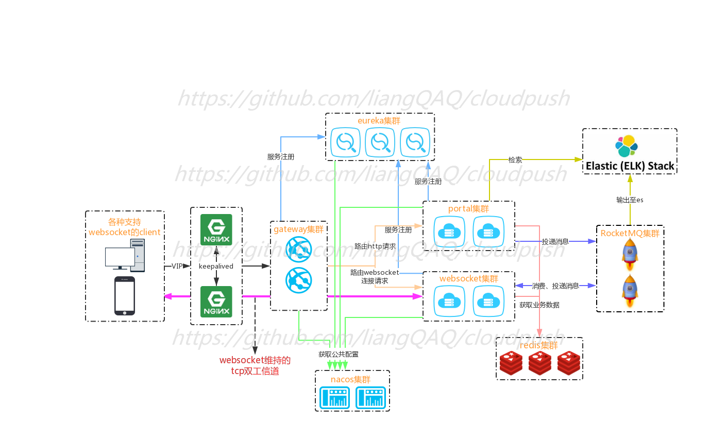

# cloudpush- 分布式推送产品
cloudpush是我对于springcloud微服务框架的一个学习实践，旨在学习微服务架构的同时，实现一个基于websocket协议，可平滑水平拓展的分布式推送产品。  

[项目相关博客](https://juejin.im/post/5da457eef265da5b7326e9eb)  

[启动教程](https://github.com/liangQAQ/cloudpush/wiki)

# 应用架构图

# 项目用到的技术
目前核心的技术栈采用的是SpringBoot2.0.1.RELEASE

## 前端使用的技术
管理台页面待开发。。

## 后端使用的技术
后端的主要架构是基于springboot.

* SpringCloud
* Netty
* Nacos
* Redis
* RocketMQ

# 项目模块说明

| tools  工具包                                | 压缩包 | 项目，或者测试中需要用的到中间件包，直接用docker更方便。。             |
| ------------------------------------------------------------ | --------- | ---------------------------------------------------- |
| cloudpush-api 公共组件部分                                    | jar       | 公共组件，很多地方都有引用         |
| cloudpush-eureka 注册中心                           | web项目  | 其他组件的注册中心，方便平滑的上下线服务                      |
| cloudpush-portal 接口服务                  | web项目   | 提供http接口服务                                             |
| cloudpush-task 后台计算服务                  | web项目   | 现仅仅根据各个websocket的连接数计算路由权重存进redis，不是运行系统的必要条件|     
| cloudpush-websocket 推送服务                | web项目  | 由springboot启动的一个netty服务，启动的netty端口提供websocket的握手，消息的收发服务                    |
| cloudpush-gateway 统一网关    | web项目   | 统一入口,便于未来鉴权，现在用作根据redis中的websocket路由权重，生成ws连接的动态路由规则（优先分配给连接数较少的实例）|

# 项目开发进度
## 注意事项

* 项目中为了性能考虑，用到了redis的管道特性，无法使用cluster集群模式，所以。。要么一个master处理写操作，要么使用Codis作代理，实现redis集群多个master处理写操作。

## 后台实现的功能有

* 推送功能(根据客户端的连接时的标识参数,以http请求或者websocket消息的形式，给一个或者多个客户端推送指定内容的websocket消息)
* 踢出过期客户端功能(客户端上报心跳，ping消息或者封装心跳格式的websocket消息，会刷新所在的websocket节点所维护的客户端的活跃时间)

## 前台项目整体的规划有

* 提供管理后台页面

## 后台规划

* 接入监控组件对应用所在服务器的cpu、网卡、内存等健康指标的监控
* 结合客户端收到消息的回执和在推送流程中的埋点，接入ELK组件实现对消息送达率，客户端会话时长的统计

# 效果图

# 如何贡献

项目对你有帮助或者启发的话

* 老哥点个star
* 提个issue或者pr参与开发
* 甚至打赏瓶水也ok O(∩_∩)O 

# 技术交流及问题解答
* 微信号: 

